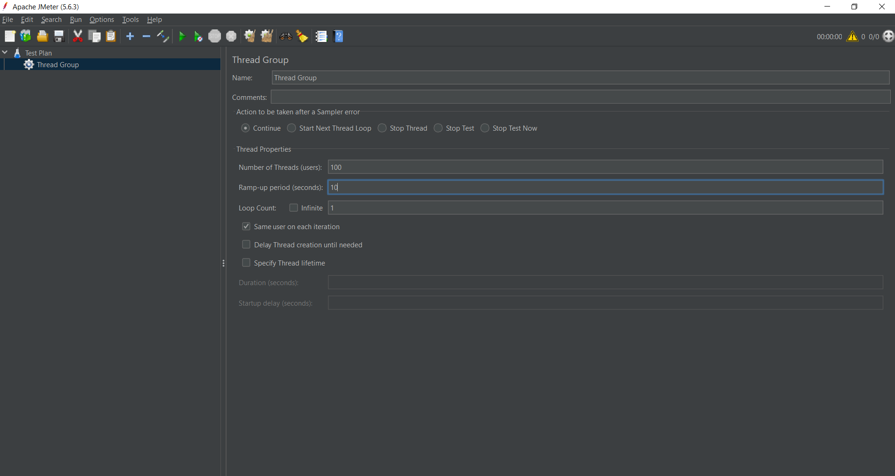
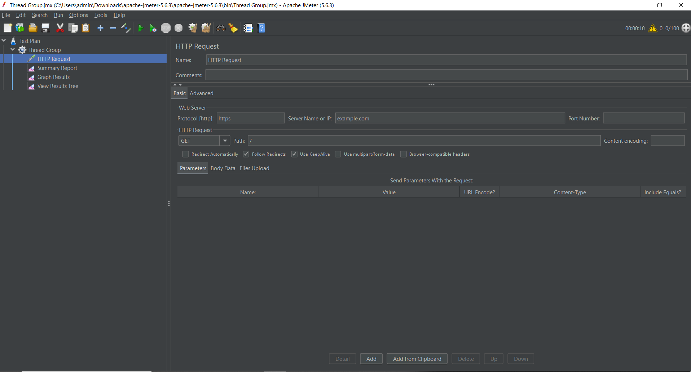
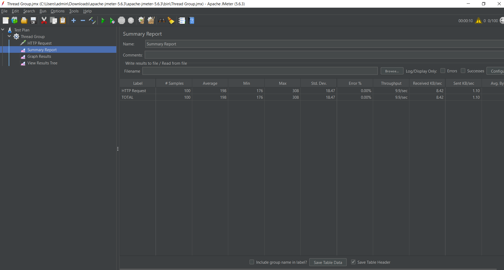
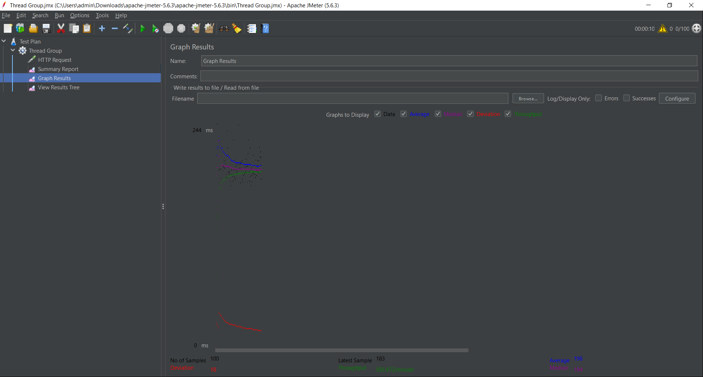

# JMeter

## 1. Giới thiệu

Bài thực hành sử dụng Apache JMeter để kiểm thử hiệu năng trang web **https://example.com** bằng cách mô phỏng nhiều người dùng truy cập đồng thời. Mục tiêu là đánh giá khả năng đáp ứng của hệ thống thông qua các chỉ số như thời gian phản hồi, tỷ lệ thành công, tỷ lệ lỗi và thông lượng (Throughput).

---

## 2. Mục tiêu

- Tìm hiểu và sử dụng công cụ Apache JMeter.
- Tạo kịch bản kiểm thử hiệu năng cho website.
- Mô phỏng người dùng truy cập đồng thời vào hệ thống.
- Thu thập và phân tích các chỉ số hiệu năng.
- Đánh giá khả năng đáp ứng của website dưới tải kiểm thử.

---

## 3. Công cụ sử dụng

- Apache JMeter
- Java Development Kit (JDK)
- GitHub

---

## 4. Kịch bản kiểm thử

### 4.1 Cấu hình Thread Group

Thread Group là thành phần dùng để mô phỏng số lượng người dùng truy cập đồng thời vào hệ thống.

Các thông số được thiết lập như sau:

| Tham số | Giá trị |
|----------|----------|
| Number of Threads (Users) | 100 |
| Ramp-up Period | 10 giây |
| Loop Count | 1 |

### HTTP Request

| Tham số | Giá trị |
|----------|----------|
| Protocol | HTTPS |
| Server Name or IP | example.com |
| Path | / |
| Method | GET |

Ý nghĩa: 

- Hệ thống sẽ mô phỏng 100 người dùng. 
- Trong vòng 10 giây, JMeter sẽ khởi tạo toàn bộ 100 người dùng.
- Mỗi người dùng gửi 1 yêu cầu tới website.

---
## 4.2 Cấu hình HTTP Request 

HTTP Request là thành phần dùng để gửi yêu cầu tới website cần kiểm thử. 

Thông số cấu hình: 

| Tham số | Giá trị | 
|----------|----------| 
| Protocol | HTTPS | 
| Server Name or IP | example.com | 
| Path | / | 
| Method | GET | 

Ý nghĩa: 

- Giao thức sử dụng là HTTPS.
- Máy chủ được kiểm thử là example.com.
- Truy cập vào trang chủ của website.
- Sử dụng phương thức GET để lấy nội dung trang web.

---

# 5. Các Listener sử dụng

Để quan sát và phân tích kết quả kiểm thử, ba Listener được sử dụng trong bài thực hành gồm: 

## 5.1 View Results Tree 

View Results Tree cho phép xem chi tiết từng yêu cầu được gửi đến máy chủ và phản hồi trả về. 

Thông tin có thể theo dõi: 

- Request gửi đi.
- Response trả về.
- Response Code.
- Response Message.
- Thời gian xử lý.

--- 

## 5.2 Summary Report Summary 

Report cung cấp các số liệu thống kê tổng hợp của toàn bộ quá trình kiểm thử. 

Các chỉ số quan trọng bao gồm: 

- Samples
- Average
- Min
- Max
- Error %
- Throughput

 

--- 

## 5.3 Graph Results 

Graph Results hiển thị kết quả kiểm thử dưới dạng biểu đồ trực quan. 

Thông qua biểu đồ có thể dễ dàng quan sát: 

- Thời gian phản hồi trung bình.
- Giá trị lớn nhất và nhỏ nhất.
- Độ lệch chuẩn.
- Xu hướng hiệu năng của hệ thống.

 

--- 

# 6. Kết quả kiểm thử 

Sau khi thực hiện kiểm thử với cấu hình đã thiết lập, JMeter thu được các kết quả như sau: 

| Chỉ số | Giá trị | 
|----------|----------| 
| Samples | 100 | 
| Successful Requests | 100 | 
| Failed Requests | 0 | 
| Error % | 0.00% | 
| Average Response Time | 198 ms | 
| Median Response Time | 194 ms | 
| Minimum Response Time | 176 ms | 
| Maximum Response Time | 308 ms | 
| Standard Deviation | 18.47 ms |
| Throughput | 9.9 requests/second |
| Received KB/sec | 8.42 | 
| Sent KB/sec | 1.10 |

--- 

# 7. Phân tích kết quả 

## 7.1 Tỷ lệ thành công 

Trong quá trình kiểm thử, tổng cộng 100 yêu cầu đã được gửi đến máy chủ. 

Kết quả: 

- 100 yêu cầu được xử lý thành công.
- 0 yêu cầu thất bại.
- Tỷ lệ lỗi (Error %) bằng 0%.

Điều này chứng tỏ website hoạt động ổn định và có khả năng tiếp nhận toàn bộ các yêu cầu từ người dùng mà không phát sinh lỗi. 

--- 

## 7.2 Thời gian phản hồi 

Các giá trị về thời gian phản hồi như sau: 

| Chỉ số | Giá trị | 
|----------|----------| 
| Min | 176 ms | 
| Average | 198 ms | 
| Median | 194 ms | 
| Max | 308 ms | 

Thời gian phản hồi trung bình chỉ khoảng 198 ms, cho thấy website phản hồi rất nhanh. 

Khoảng cách giữa giá trị thấp nhất và trung bình không lớn, chứng tỏ hệ thống duy trì hiệu năng tương đối đồng đều trong suốt quá trình kiểm thử. 

--- 

## 7.3 Độ ổn định của hệ thống 

Độ lệch chuẩn (Standard Deviation) đạt 18.47 ms. 

Giá trị này khá thấp so với thời gian phản hồi trung bình, cho thấy: 

- Hiệu năng hệ thống ổn định.
- Thời gian xử lý ít biến động.
- Không xuất hiện hiện tượng nghẽn hoặc tăng đột biến thời gian phản hồi.
-
- Điều này chứng minh rằng máy chủ duy trì được khả năng xử lý ổn định đối với toàn bộ số lượng người dùng được mô phỏng.

--- 

## 7.4 Thông lượng (Throughput) 

Thông lượng đạt: 

-9.9 yêu cầu/giây 

Thông lượng thể hiện số lượng yêu cầu mà hệ thống có thể xử lý trong một đơn vị thời gian. 

Với kết quả đạt gần 10 yêu cầu mỗi giây và không xuất hiện lỗi, có thể nhận thấy máy chủ đáp ứng tốt tải kiểm thử hiện tại. 

--- 

## 7.5 Lưu lượng mạng 

Kết quả ghi nhận: 

- Received: 8.42 KB/sec
- Sent: 1.10 KB/sec

Lượng dữ liệu truyền tải tương đối thấp do website example.com là một trang web đơn giản với nội dung tĩnh và dung lượng phản hồi nhỏ. 

--- 

# 8. Đánh giá chung 

## Ưu điểm 

- Không phát sinh lỗi trong quá trình kiểm thử.
- Thời gian phản hồi nhanh.
- Hệ thống hoạt động ổn định.
- Khả năng xử lý tải tốt đối với 100 người dùng đồng thời.

## Hạn chế 

- Bài kiểm thử chỉ được thực hiện với một trang web đơn giản.
- Chưa đánh giá được khả năng chịu tải ở mức cao hơn như 500 hoặc 1000 người dùng.
- Chưa kiểm thử các chức năng động như đăng nhập, tìm kiếm hoặc truy vấn cơ sở dữ liệu.

--- 

# 9. Kết luận 

Qua bài thực hành sử dụng Apache JMeter để kiểm thử hiệu năng website https://example.com, có thể kết luận rằng hệ thống hoạt động ổn định và đáp ứng tốt trong điều kiện kiểm thử với 100 người dùng truy cập đồng thời. 

Kết quả cho thấy: 

- 100% yêu cầu được xử lý thành công.
- Không xuất hiện lỗi trong quá trình kiểm thử.
- Thời gian phản hồi trung bình chỉ 198 ms.
- Độ lệch chuẩn thấp, thể hiện tính ổn định cao.
- Throughput đạt 9.9 requests/second. Nhìn chung, website đáp ứng tốt tải kiểm thử được thiết lập và cho thấy hiệu năng ổn định trong điều kiện mô phỏng của bài thực hành.

Nhìn chung, website hoạt động ổn định, phản hồi nhanh và đáp ứng tốt tải kiểm thử được thiết lập trong bài thực hành.

---
